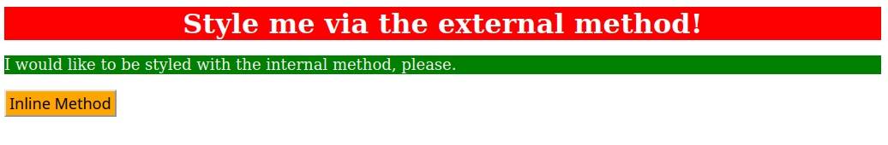

# CSS Methods Practice

A comprehensive demonstration of the three fundamental ways to apply CSS styling to HTML elements.

## 🔗 Live Demo
[View Live Demo](https://nithishkumar0283.github.io/Fullstack_learning_path/css/01-css-methods/)

## 🖼️ Visual Result



*Three distinctly styled elements demonstrating each CSS method*


## 🎯 Project Overview

This project showcases my understanding of CSS implementation methods through practical examples, demonstrating when and how to use each approach effectively.

## 📁 Project Structure

```
01-css-methods/
├── index.html          # Main HTML file with all three CSS methods
├── styles.css          # External stylesheet for div styling
├── desired-outcome.png # Visual reference for the final result
└── README.md          # Project documentation
```

## 🎨 Implementation Details

### 1. External CSS Method
**Target Element:** `<div class="external">Style me via the external method!</div>`

**HTML:**
```html
<link rel="stylesheet" href="./styles.css">
<div class="external">Style me via the external method!</div>
```

**CSS (styles.css):**
```css
.external {
  background-color: red;
  color: white;
  font-size: 32px;
  text-align: center;
  font-weight: bold;
}
```

### 2. Internal CSS Method
**Target Element:** `<p id="para">I would like to be styled with the internal method, please.</p>`

**HTML:**
```html
<p id="para">I would like to be styled with the internal method, please.</p>
<style>
  #para {
    background-color: green;
    color: white;
    font-size: 18px;
  }
</style>
```

### 3. Inline CSS Method
**Target Element:** `<button>Inline Method</button>`

**HTML:**
```html
<button style="background-color: orange; font-size: 18px;">Inline Method</button>
```

## 💻 Code Structure

### HTML Features
- Semantic HTML5 structure
- Proper meta tags for responsiveness and character encoding
- Linked external stylesheet in `<head>`
- Internal styles placed at the end of `<body>`
- Inline styles applied directly to button element

### CSS Selectors Used
- **Class selector** (`.external`) for external CSS
- **ID selector** (`#para`) for internal CSS
- **Inline styles** for direct element styling


## 🧠 Key Learning Points

### When to Use Each Method:

**External CSS:**
- ✅ Best for multiple pages
- ✅ Maintains consistency across site
- ✅ Easier maintenance and updates
- ✅ Caching benefits for performance

**Internal CSS:**
- ✅ Page-specific styles
- ✅ Small projects or single pages
- ✅ When external file isn't practical

**Inline CSS:**
- ✅ Quick styling fixes
- ✅ Dynamic styles (JavaScript manipulation)
- ✅ Email templates
- ❌ Generally avoid for maintainability

## 🛠️ Technologies Used

- HTML5
- CSS3
- Basic CSS properties: `background-color`, `color`, `font-size`, `text-align`, `font-weight`


## 📚 Skills Demonstrated

- Understanding of CSS cascade and specificity
- Proper HTML document structure
- CSS selector types (class, ID, inline)
- Responsive meta viewport setup
- Clean, semantic code organization

---

*Part of my daily web development learning journey - building strong fundamentals one project at a time.*