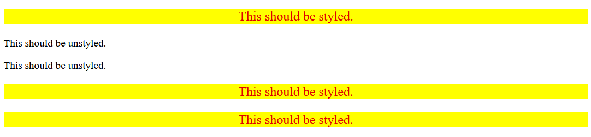

# **Descendant Combinator Practice**

A hands-on project demonstrating the power of CSS descendant combinators to selectively style nested elements while leaving similar elements outside the hierarchy untouched.

## **🔗 Live Demo**
[View Live Demo](https://nithishkumar0283.github.io/Fullstack_learning_path/css/05-descendant-combinator/)

## **🖼️ Visual Result**



*Five paragraph elements where only those nested inside container divs receive styling, demonstrating precise descendant targeting*

## **🎯 Project Overview**

This project focuses on mastering CSS descendant combinators, understanding hierarchical element relationships, and learning to apply selective styling based on element ancestry rather than element type alone.

## **📁 Project Structure**

```
05-descendant-combinator/
├── index.html          # HTML file with nested element structure
├── style.css           # CSS file demonstrating descendant combinators
├── desired-outcome.png # Visual reference for the final result
└── README.md          # Project documentation
```

## **🎨 Implementation Details**

### **HTML Structure**

```html
<div class="container">
  <p class="text">This should be styled.</p>
</div>
<p class="text">This should be unstyled.</p>
<p class="text">This should be unstyled.</p>
<div class="container">
  <p class="text">This should be styled.</p>
  <p class="text">This should be styled.</p>
</div>
```

### **CSS Styling Rules**

#### **Descendant Combinator Selector**
**Target:** Only `p` elements with class `text` that are descendants of elements with class `container`

```css
.container .text {
    background-color: yellow;
    color: red;
    font-size: 20px;
    text-align: center;
}
```

## **💻 Key Concepts Demonstrated**

### **CSS Descendant Combinator (` ` - Space)**
* ✅ Targets elements that are nested inside other elements
* ✅ Uses whitespace to separate ancestor and descendant selectors
* ✅ Applies to ALL levels of nesting (direct children and deeper descendants)
* ✅ Provides precise control over hierarchical styling

### **Selector Hierarchy Understanding**
1. **Ancestor Element:** `.container` (the parent div)
2. **Descendant Element:** `.text` (the nested p elements)
3. **Combinator:** Space character connecting the selectors
4. **Specificity:** Higher than individual class selectors

### **Selective Styling Strategy**
* **Styled Elements:** Paragraphs inside `.container` divs
* **Unstyled Elements:** Paragraphs outside `.container` divs
* **Same Class, Different Context:** Demonstrates context-dependent styling

## **🧠 Key Learning Points**

### **When to Use Descendant Combinators:**
* Need to style elements based on their context/location
* Want to avoid affecting similar elements in different locations
* Building component-based designs with internal styling
* Creating layout-specific element behaviors

### **Descendant vs Other Combinators:**
* **Descendant (`.parent .child`):** Any level of nesting
* **Child (`.parent > .child`):** Direct children only
* **Adjacent Sibling (`.element + .sibling`):** Next sibling element
* **General Sibling (`.element ~ .sibling`):** All following siblings

### **CSS Specificity Impact:**
* **Descendant combinator:** Higher specificity than single selectors
* **Calculation:** Class + Class = 0-2-0 specificity
* **Override behavior:** More specific than `.text` alone
* **Cascade influence:** Later rules with same specificity override earlier ones

## **🛠️ Technologies Used**

* HTML5
* CSS3
* CSS Descendant Combinators
* CSS Class Selectors (`.`)
* Typography and color properties
* Text alignment techniques

## **📚 Skills Demonstrated**

* Advanced CSS selector relationships and hierarchy
* Understanding element nesting and DOM tree structure  
* Contextual styling based on element ancestry
* CSS specificity calculation and application
* Selective element targeting without affecting siblings
* Layout-aware styling techniques

## **🔍 Self-Check Validation**

✅ **Do the elements that contain "This should be styled" have the correct styles applied?** Yes - All paragraphs inside `.container` divs receive yellow background, red text, 20px font size, and center alignment

✅ **Do the elements that contain "This should be unstyled" have no styles applied?** Yes - Paragraphs outside `.container` divs remain unstyled with default browser styling

## **🎨 Styling Specifications Met**

✅ **Descendant Element Requirements:**
* Yellow background (`background-color: yellow`)
* Red text color (`color: red`)  
* 20px font size (`font-size: 20px`)
* Center text alignment (`text-align: center`)

✅ **Targeting Precision:**
* Only `p` elements that are descendants of `div` elements
* Elements outside the container hierarchy remain unaffected
* Selective styling based on DOM position

## **💡 Advanced Concepts**

### **DOM Tree Relationships:**
```
body
├── div.container
│   └── p.text (STYLED - descendant of .container)
├── p.text (UNSTYLED - not descendant of .container)
├── p.text (UNSTYLED - not descendant of .container)
└── div.container
    ├── p.text (STYLED - descendant of .container)
    └── p.text (STYLED - descendant of .container)
```

### **Combinator Selector Variations:**
* **Type + Class:** `div .text` (any .text inside div)
* **Class + Class:** `.container .text` (current implementation)
* **Type + Type:** `div p` (any p inside div)
* **Multiple Levels:** `.container .wrapper .text` (deeper nesting)

### **CSS Architecture Benefits:**
* **Component Isolation:** Styles don't leak outside containers
* **Contextual Behavior:** Same elements behave differently in different contexts
* **Maintainable Code:** Clear relationship between structure and styling
* **Scalable Design:** Easy to add new containers with consistent internal styling

## **🎯 Real-World Applications**

### **Common Use Cases:**
* **Navigation menus:** Style links only within nav elements
* **Card components:** Style content only within card containers
* **Sidebar elements:** Different styling for sidebar vs main content
* **Modal dialogs:** Special styling for elements within modals

### **Best Practices:**
* Use descendant combinators for component-specific styling
* Avoid overly deep nesting (keep selectors readable)
* Consider alternative combinators for more precise targeting
* Balance specificity to avoid CSS override conflicts

*Part of my daily web development learning journey - mastering CSS fundamentals one concept at a time.*