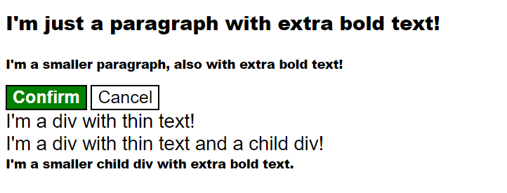

# Descendant Combinator Practice

🔗 [Live Demo](https://nithishkumar0283.github.io/Fullstack_learning_path/css/06-cascade-fix/)  
📂 [View on GitHub](https://github.com/NITHISHKUMAR0283/Fullstack_learning_path/tree/main/css/06-cascade-fix)

---



A hands-on project demonstrating the power of **CSS descendant combinators** to selectively style nested elements while leaving similar elements outside the hierarchy untouched.

---

## 🎯 Project Overview

This project helps you master the **CSS descendant combinator**, understand **hierarchical element relationships**, and apply **selective styling** based on **element ancestry**, not just type or class.

---

## 📁 Project Structure

```
06-cascade-fix/
├── index.html           # HTML file with nested element structure
├── style.css            # CSS file demonstrating descendant combinators
├── desired-outcome.png  # Visual reference for the final result
└── README.md            # Project documentation
```

---

## 🎨 Implementation Details

### ✅ HTML Structure

```html
<div class="container">
  <p class="text">This should be styled.</p>
</div>
<p class="text">This should be unstyled.</p>
<p class="text">This should be unstyled.</p>
<div class="container">
  <p class="text">This should be styled.</p>
  <p class="text">This should be styled.</p>
</div>
```

### ✅ CSS Styling Rules

```css
.container .text {
  background-color: yellow;
  color: red;
  font-size: 20px;
  text-align: center;
}
```

💡 This selector ensures **only** the `.text` elements **inside `.container`** are styled.

---

## 🧠 Key Concepts Demonstrated

### 🔹 CSS Descendant Combinator (` `)

* Targets elements nested inside other elements
* Works at any depth, not just direct children
* Enables precise contextual styling

### 🔹 Selector Hierarchy

| Element Type | Selector     |
| ------------ | ------------ |
| Ancestor     | `.container` |
| Descendant   | `.text`      |
| Combinator   | Space (` `)  |

### 🔹 Specificity

* `.container .text` → Specificity: **0-2-0**
* More specific than `.text` alone

---

## 📘 Combinator Comparisons

| Combinator       | Example            | Behavior               |
| ---------------- | ------------------ | ---------------------- |
| Descendant       | `.parent .child`   | Any level of nesting   |
| Child            | `.parent > .child` | Direct child only      |
| Adjacent Sibling | `.el + .sib`       | Immediate next sibling |
| General Sibling  | `.el ~ .sib`       | All following siblings |

---

## 🛠️ Technologies Used

* HTML5
* CSS3
* CSS Descendant Combinators
* Class Selectors
* Basic Text Styling

---

## 📚 Skills Demonstrated

* Advanced selector relationships
* DOM tree awareness
* Contextual styling
* Specificity calculation
* Clean, maintainable CSS

---

## ✅ Self-Check

* [x] Paragraphs inside `.container` are styled
* [x] Paragraphs outside `.container` remain unstyled
* [x] CSS uses descendant combinator syntax

---

## ✨ Styling Reference

| Property         | Value  |
| ---------------- | ------ |
| Background Color | yellow |
| Text Color       | red    |
| Font Size        | 20px   |
| Text Alignment   | center |

---

## 🧠 DOM Tree Visualization

```
body
├── div.container
│   └── p.text (✅ STYLED)
├── p.text (🚫 UNSTYLED)
├── p.text (🚫 UNSTYLED)
└── div.container
    ├── p.text (✅ STYLED)
    └── p.text (✅ STYLED)
```

---

## 🧩 Real-World Applications

* Style `<a>` tags only inside `nav`
* Apply styles to `.card .content` inside cards
* Different sidebar and main content styles
* Scoped modal component styles

---

## ✅ Best Practices

* Use combinators for contextual styling
* Avoid deep nesting for readability
* Balance specificity to prevent conflicts

---

## 🚀 Learning Journey

Part of my daily **web development learning journey** — mastering CSS fundamentals one concept at a time.