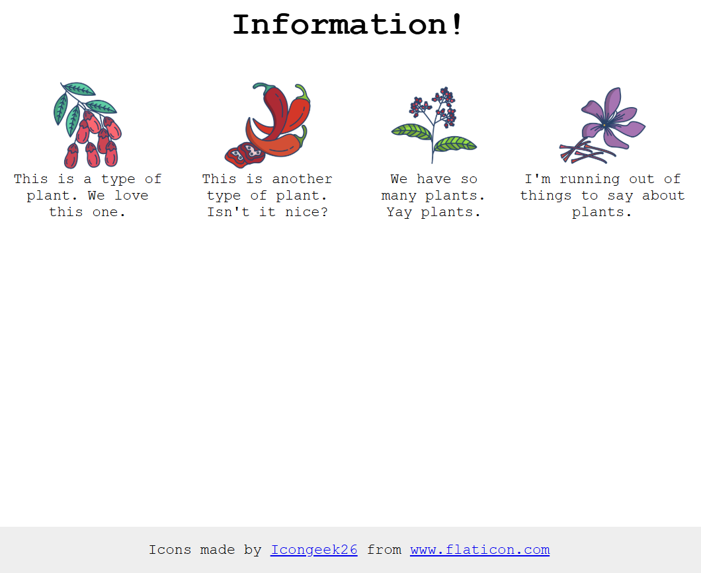

# A very common website feature

The goal of this exercise is to recreate a section that is found on many informational websites.

For this one you will need to edit the HTML a little bit too. We can't be making things _too_ easy for you. You'll want to add containers around the various elements so that you can flex them. Good luck!

##liveurl:

[live_Demo](https://nithishkumar0283.github.io/Fullstack_learning_path/css/-flex-information/)
## Before using flexbox:

## After applying flexbox:

## Desired outcome

### Self Check

- All items are centered on the page (horizontally, not vertically).
- The title is centered on the page.
- There is 32px between the title and the 'items.'
- There is 52px between each item.
- The items are arranged horizontally on the page.
- The items are only 200px wide and the text wraps.
- The item text is centered.
